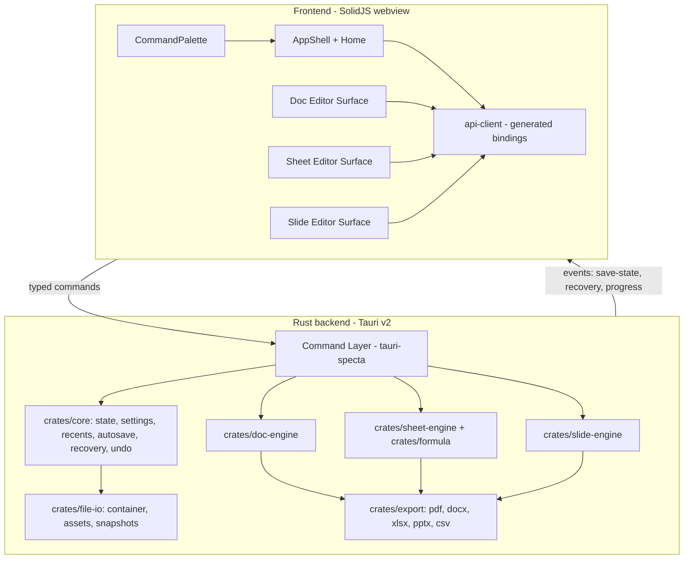

# Redoc — Offline-First Desktop Office Suite: Implementation Plan

Greenfield monorepo at `C:\Users\Papan Ghosh\Desktop\Projects\redoc`. One Tauri v2 app, three editor modes, Rust owns all file/format/logic work, TypeScript owns interaction and rendering orchestration. Bias throughout: simplicity over completeness, 95% use case, ship small and reliable.

## 1. Executive summary

Redoc is a single-window desktop app with a home screen and three editor surfaces (Doc, Sheet, Slides) switched via a top-right segmented control (and `Ctrl+Alt+1/2/3`). All modes share: file manager, autosave/crash recovery, undo/redo infrastructure, recent files, settings, theming, command palette, shortcut registry, and the import/export pipeline. The native file format is a single ZIP container (`.redoc`) with a mode discriminator, versioned JSON schemas, and an assets folder. Rust crates hold the document models, formula engine, file I/O, import/export, and autosave; the SolidJS frontend holds the three editor surfaces, loaded on demand via code splitting. Target: installed size <= 60 MB, cold start < 1.5 s on mid hardware, frontend shipped assets < 2 MB gzipped.

Key delegated decisions (justified in sections 4-5): SolidJS over React/Svelte; ProseMirror core (not TipTap, not a custom contenteditable) for the doc editor; fully custom canvas grid + custom Rust formula engine for sheets (no HyperFormula); DOM/SVG renderer for slides; `tauri-specta` for end-to-end typed commands/events.

## 2. Product scope and non-goals

**v1 scope (the boring 95%, done well):**
- Home screen: New Document / New Spreadsheet / New Presentation, Open File, Recent Files (persisted, pinned entries), search-over-recents, settings, theme toggle, drag-and-drop open.
- Doc: paragraphs, headings 1-3, bold/italic/underline/strike, text color + highlight, bulleted/numbered lists, blockquote, code block, tables (simple grid, merge cells deferred), hyperlinks, images, alignment, indent, line spacing, find & replace, word count, undo/redo, print preview, paginated + focused layout, PDF + DOCX export.
- Sheet: virtualized canvas grid (100k x 1k cells addressable), cell editing, row/col resize, freeze panes, range selection, copy/cut/paste (TSV interop with real spreadsheets), fill handle (series + copy), number/text/alignment formats, formulas with cross-cell and cross-sheet refs, functions: SUM, AVERAGE, MIN, MAX, COUNT, COUNTA, IF, AND, OR, NOT, ROUND, CONCAT, LEFT, RIGHT, LEN, ABS; sort + filter per range, find, CSV import/export, XLSX import/export, 3 chart types (bar, line, pie) rendered to SVG, multiple sheets with tabs, undo/redo, full keyboard navigation.
- Slides: deck with thumbnails panel, text boxes, basic shapes (rect, ellipse, line, arrow), images, drag/resize/rotate-free repositioning, 6 built-in themes, 6 layouts (title, title+body, section, two-column, image+caption, blank), duplicate/reorder slides, speaker notes, presenter view (second window with notes + timer), PDF export, PPTX export (basic), keyboard-first editing. No animations/transitions in v1 beyond a simple fade toggle.
- Shared: autosave (debounced, Rust-side snapshots), crash recovery prompt on next launch, undo/redo per open document, command palette (`Ctrl+K`), shortcut registry with cheatsheet, light/dark/system theme, zoom controls, status bar (mode, save state, word count / cell info / slide n-of-m), toasts, settings store, localization-ready strings (English only in v1, all strings in `packages/ui/src/i18n/en.ts`).

**Explicit non-goals for v1 (with rationale):**
- Real-time collaboration, comments, suggestions, version history UI — requires CRDT/OT infrastructure and a server; 5-10x scope multiplier.
- Macros/scripting, pivot tables, full Excel function library, conditional formatting rules engine, chart designer beyond 3 types — large engines, low 95% value.
- DOCX/XLSX/PPTX *import* fidelity beyond common constructs; DOCX import limited to paragraphs/runs/headings/lists/tables/images.
- Cloud sync, accounts, permissions, telemetry (hooks exist but compiled-out unless explicitly enabled at build time; nothing phones home in v1).
- Advanced animations, embedded video, audio.
- Multi-window editing of the same document (presenter view is the only second window).

## 3. Architecture overview

One app shell, three lazy-loaded editor surfaces, one typed RPC boundary, Rust service layer beneath.



**Boundary rules (enforced by code review + dependency direction):**
- Frontend never touches the filesystem directly; all I/O goes through commands.
- Rust never returns UI-shaped data; it returns domain models, frontend maps to view models.
- All command payloads and event payloads are Rust structs annotated for `tauri-specta`, which generates `packages/api-client/src/bindings.ts` at build time. No hand-written message shapes.
- Editors communicate with Rust only through `api-client`; shared chrome (palette, shortcuts, status bar) lives in `packages/editor-common` and consumes the same client.
- Long operations (export, import, large recalc) run as async commands and report progress via events; UI shows cancellable progress.

## 4. Rust backend design

Workspace crates under [crates/](crates/):

- `crates/core` — `AppState` (open documents registry, active mode), settings store (JSON in `app_config_dir`), recent-files store (JSON, capacity 50, pin support), autosave scheduler (tokio interval + dirty check, debounce coalescing), crash-recovery manager (clean-exit sentinel file; on boot, sentinel absent + snapshots present => recovery list), undo checkpoint store (bounded: last 20 checkpoints or 25 MB per document, LRU evict), logging via `tracing` + `tracing-appender` to `app_log_dir` with 5 MB rotation. Document identity: UUIDv7 assigned at creation, embedded in file `meta.json`.
- `crates/file-io` — `.redoc` container read/write (`zip` crate, deflate), atomic writes (write to temp file in same dir + rename; fsync), asset store (content-addressed by SHA-256 inside container `assets/`, deduped), snapshot writer (autosave copies to `app_data_dir/autosave/<doc-id>.redoc` with 3-deep rotation), permission-safe path handling via Tauri fs scope (user-picked paths only, plus app dirs).
- `crates/doc-engine` — validates and transforms the ProseMirror-flavored JSON doc model (schema enforced in Rust: node/mark types, attrs), word count, find/replace over text nodes, DOCX/PDF layout input. The authoritative schema lives here as Rust types; the PM schema in TS is generated/mirrored from it (single source: a `schema.json` emitted by doc-engine build script, consumed by `packages/doc-editor`).
- `crates/formula` — standalone formula engine: tokenizer, Pratt parser to AST, dependency graph (cell -> dependents), topological recalc with dirty marking, cycle detection (returns `#CYCLE!`), ~18 functions behind a registry trait so new functions are additive. Errors as typed enum (`#DIV/0!`, `#REF!`, `#NAME?`, `#VALUE!`). Property tests + fuzz target. No UI knowledge.
- `crates/sheet-engine` — workbook model (sheets, sparse cell map keyed by `(row, col)` via `BTreeMap` per row for memory efficiency), merged cells, col/row sizes, freeze panes, named ranges, sort/filter ops, fill-series logic, CSV parse/serialize, TSV clipboard format, owns a `formula::Engine` instance per workbook.
- `crates/slide-engine` — deck model, slide/element ops, theme resolution, layout instantiation, notes, PDF/PPTX layout input.
- `crates/export` — pure functions `model -> bytes`:
  - PDF: `printpdf` for doc/sheet (simple line-breaking layout engine, system font embedding via `fontdb` + subsetting); slides rendered per-slide to PNG with `tiny-skia` rasterizing an SVG scene graph, embedded one image per PDF page. Deterministic, no pixel-perfect DOCX-matching claims.
  - DOCX: `docx-rs` for export (headings, runs, lists, tables, images). Import: custom minimal parser over `zip` + `quick-xml` extracting paragraphs/runs/headings/lists/tables/images into the doc model (Phase 4).
  - XLSX: `rust_xlsxwriter` export; `calamine` import (values + formats + formulas-as-text where possible).
  - PPTX: custom minimal OOXML writer (zip + hand-written XML for slides/shapes/text/images), Phase 4. PPTX import deferred past v1.
  - CSV: hand-rolled (RFC 4180), delimiter sniffing, UTF-8 BOM handling.

**Crate selection policy:** every dependency needs an entry in `crates/README-deps.md` (purpose, approx binary-size cost, alternatives rejected). Allowed major deps: `serde`, `serde_json`, `zip`, `quick-xml`, `calamine`, `rust_xlsxwriter`, `docx-rs`, `printpdf`, `tiny-skia`, `fontdb`, `thiserror`, `tracing`, `tracing-appender`, `parking_lot`, `uuid`, `sha2`, `tauri-specta`. Profile: `opt-level = "z"`, `lto = "fat"`, `codegen-units = 1`, `strip = true`, panic kept as `unwind` (crash-recovery correctness) with `catch_unwind` at every command boundary converting panics into typed errors.

**Tauri v2 surface:** single `invoke_handler` registered from a generated command list; events emitted on one channel namespace `redoc://events/{kind}`. Plugins allowed: `tauri-plugin-dialog` (open/save pickers), `tauri-plugin-fs` (scoped), `tauri-plugin-updater` (release builds only, signed), `tauri-plugin-window-state`. Nothing else. Capabilities file grants only: dialog open/save, fs read/write of user-picked paths + `$APPDATA/**`, window state, updater. No shell, no HTTP, no global shortcuts in v1.

## 5. TypeScript frontend design

**Framework: SolidJS 1.x + Vite + TypeScript strict.** Justification: (a) fine-grained reactivity with no VDOM diffing — critical for a canvas-adjacent grid and frequent selection updates without GC pressure; (b) runtime ~7 kB vs React ~45 kB; (c) JSX keeps hiring/onboarding cost low; (d) first-class Vite + Tauri support. React is the fallback if team familiarity outweighs size/perf. Svelte rejected: weaker typing story for complex editor state, smaller desktop-app ecosystem.

**Structure:**
- `apps/desktop/src/` — bootstrap, router-free mode switching (editors are not routes; they are lazy `createResource`/`lazy()` chunks so each editor code-splits), `AppShell` (title bar, mode switcher, status bar, palette mount).
- `packages/ui` — design system: buttons, menus, dialogs, toasts, segmented control, tooltip, virtual list primitives; CSS via vanilla CSS custom properties + a small `theme.css` (light/dark tokens), no CSS-in-JS runtime, no Tailwind (avoids build complexity; ~8 kB hand-written utility layer instead).
- `packages/editor-common` — command registry (`Command { id, title, keybinding, when, run }`), keymap resolver with per-mode scopes and user overrides from settings, command palette UI, toolbar framework (declarative toolbar spec per mode), find UI scaffold, zoom controller, status-bar slots.
- `packages/api-client` — generated `bindings.ts` (tauri-specta), thin `invoke` wrappers returning `Result` types, event subscription helpers.
- `packages/doc-editor` — ProseMirror (`state`, `view`, `model`, `transform`, `history`, `keymap`, `commands`, `tables`, `schema-list`, `inputrules` — cherry-picked, ~220 kB gz total, the one justified framework exception because a correct custom contenteditable layer is a multi-quarter project and the #1 product-killing risk), custom node views for tables/images, find & replace plugin, word-count plugin, pagination view (CSS columns per page vs. continuous — decide in Phase 1 spike; default continuous with page-break indicators, print stylesheet for paginated print preview).
- `packages/sheet-editor` — canvas grid renderer (single `<canvas>`, devicePixelRatio-aware, draws only visible rows/cols, cell text cache keyed by content+format hash, damage-rect redraws), DOM overlay editors (active-cell input, formula bar), selection model, fill-handle drag logic, chart panel rendering SVG from sheet data, sheet tab bar.
- `packages/slide-editor` — slide canvas as scaled DOM/SVG (`transform: scale()` for zoom; crisp text, easy hit-testing), thumbnail strip (mini SVG renders, memoized), drag/resize with pointer capture, notes pane, presenter window bootstrap (Tauri second window, syncs via events through Rust).
- `packages/icons` — hand-picked SVGs inlined as Solid components (~60 icons, < 30 kB), no icon font, no full packs.
- `packages/utils` — debounce/throttle, id gen, result types, string helpers.

**State management:** Solid stores per open document (`DocState { model, selection, dirty, saveState }`) held in a `DocumentManager` context; ephemeral UI state (toolbar open, palette query) in local signals. Single source of truth for dirty state is Rust (core tracks it); frontend mirrors via events. Mode switching keeps all three editors mounted-but-hidden once opened (state preserved, unsaved changes retained), with the inactive editors' rendering paused via `IntersectionObserver`-free explicit `active` flag; memory bounded by closing documents, not modes.

**Loading:** Doc editor chunk loads on first doc open/mode switch; sheet/slide same. Home screen + shell target < 250 kB gz initial.

## 6. Shared core modules

Mapping of the required platform layer to concrete owners:

- Application state — `crates/core::AppState` + frontend `DocumentManager`.
- File manager / recents / autosave / crash recovery / undo checkpoints — `crates/core` + `crates/file-io` (see section 4). Autosave: frontend sends `document_changed` (content hash + serialized body) debounced 2 s; Rust writes snapshot only if hash differs; on clean quit sentinel written; on boot with dirty sentinel, home shows "Recovered unsaved work" entries.
- Clipboard — frontend `navigator.clipboard` + Tauri clipboard for internal formats; sheet TSV, doc HTML+plain, slide internal JSON for cross-mode copy.
- Import/export pipeline — `crates/export` behind `export_document(cmd)` / `import_file(path)` commands with progress events; format detection by extension + magic bytes.
- Theme system — CSS variables + `data-theme` on `<html>`; settings-driven; system via `matchMedia`.
- Command palette + shortcut registry — `packages/editor-common`; registry serializable so the cheatsheet and settings UI render from the same data.
- Settings store — `crates/core` JSON file, typed via specta; frontend caches and subscribes.
- Localization — string table module, `t(key)` function, interpolation; v1 ships `en` only.
- Document identity/version — UUIDv7 + `formatVersion` integer in `meta.json`; migrations run in `crates/file-io` on open.
- Dirty-state tracking — content-hash comparison in Rust; `save_state` events (`Saved | Saving | Dirty | Error`) drive the status bar.
- Permission-safe file access — Tauri fs scope + user-picked paths; recovery dir internal.
- Logging/diagnostics — `tracing` to file; "Open logs folder" in settings; frontend errors forwarded via a `log_frontend_error` command.
- Telemetry — behind a `telemetry` cargo feature + Vite flag, both off by default; when on, only local counters written to log file. No network code compiled in v1.

## 7. Data model and file format

**Container: `<name>.redoc`** — ZIP (deflate), one file for all modes; the mode discriminator routes to the right editor on open. Double-click file association opens correct mode automatically.

```
meta.json        -> { formatVersion: 1, id, mode: "doc"|"sheet"|"slide",
                      title, createdAt, updatedAt, author?, appVersion,
                      settings: {...}, lastPosition: {...}, dirtyOnCrash: bool }
body.json        -> mode-specific document body (schema below)
assets/<sha256>  -> binary assets (images), content-addressed, deduped
history/<n>.json -> last N undo checkpoints (compact op lists, capped)
```

JSON-inside-ZIP chosen over CBOR: deflate gets most of the size win, JSON stays debuggable and diff-friendly, and `serde_json` is smaller than adding CBOR. Revisit in v2 if profiling says otherwise.

**Shared metadata fields** (all modes): `id`, `title`, `createdAt`, `updatedAt`, `formatVersion`, `mode`, `assets[]` (hash, mime, width/height), `settings`, `pageConfig`/`canvasConfig`, `author?`, `lastOpenedPosition` (scroll offset / active cell / slide index). `dirty` is runtime-only, never persisted as truth — recomputed by hash.

**Mode bodies:**
- Doc: ProseMirror doc JSON `{ type: "doc", content: [...] }` validated against `crates/doc-engine` schema (`paragraph|heading|blockquote|code_block|table|image|horizontal_rule` nodes; `bold|italic|underline|strike|color|highlight|link` marks).
- Sheet: `{ sheets: [{ id, name, cells: { "r:c": { v, f?, t, s? } }, colWidths, rowHeights, freeze, merges, namedRanges, filters }], activeSheet, styles: [...] }` — sparse map keeps files tiny for real-world sheets.
- Slide: `{ slides: [{ id, layout, elements: [{ id, kind: text|shape|image, x,y,w,h, rotation, style, content }], notes }], theme, canvasSize }` — positions in deck units (960x540 logical).

**Migration strategy:** `formatVersion` checked on open; `crates/file-io::migrations` is an ordered list of pure `fn migrate_vN(body) -> body` functions, run in sequence, tested round-trip; unknown newer version => read-only open with clear banner. Undo checkpoints from older versions are dropped on migrate (documented, acceptable).

## 8. Each editor mode in detail

**Doc editor**
- Rendering: ProseMirror DOM rendering (correct text layout for free), custom node views only for tables and images. Continuous scroll with page-break indicators for v1; print preview via dedicated print stylesheet + system print (PDF export is the pixel-stable path).
- Toolbar: block type, inline marks, color/highlight, lists, indent, align, link, table insert, image insert — declarative spec in `editor-common` toolbar framework.
- Find & replace: PM plugin with match decorations, replace-all; count in status bar. Word count: debounced, computed in Rust from serialized model on autosave boundary (avoids double implementation; fast enough at 2 s cadence).
- Shortcuts: standard office set (`Ctrl+B/I/U`, `Ctrl+K` link conflicts with palette — link is `Ctrl+Shift+K` here, documented).

**Sheet editor**
- Rendering: canvas grid, virtualized both axes; row/col header rendering on same canvas; cell editor and formula bar are DOM overlays. Text measurement cache (`Map<hash, width>`) with capacity bound. Redraw only damaged regions on edit/scroll; full redraw on theme/zoom.
- Editing: F2/double-click edit, `Esc` cancel, `Enter` commit-down, `Tab` commit-right; fill handle drag with series detection (numbers, dates-as-numbers, text+number suffix); copy/paste TSV two-way compatible with Excel/Sheets.
- Formulas: parsed on commit in Rust; recalc incremental via dep graph; cross-sheet refs `Sheet2!A1`; errors rendered in-cell with tooltip.
- Charts: select range -> insert chart (bar/line/pie) -> floating SVG object anchored to cells; data re-read on recalc.
- Sort/filter: toolbar-applied to selection or table range; filter state persisted in model.
- Undo/redo: command-pattern ops (`SetCells`, `ResizeCols`, `SortRange`, `InsertSheet`, ...) with inverses, stack depth 200.

**Slide editor**
- Rendering: slide = one absolutely-positioned SVG scene at logical 960x540 scaled via CSS transform; thumbnails = same scene at 0.12 scale, memoized per slide version.
- Editing: click-drag move, 8-handle resize, `Alt+drag` duplicate, arrow-key nudge (shift = 10x), double-click text edit via overlay textarea, alignment guides (canvas-center + element edges) with snapping.
- Themes: 6 JSON theme files (fonts from system stack, color tokens) in `packages/slide-editor/themes/`; switching re-resolves element styles non-destructively (explicit element overrides win).
- Presenter view: Tauri second window showing current slide + notes + elapsed timer; navigation events routed through Rust (`presenter_nav` command, `slide_changed` event) so the main window follows.
- Animation: single optional per-deck "fade between slides" flag in presenter/export only. Nothing else.

## 9. Import/export strategy

- Export PDF: all modes, Phase-appropriate (doc Phase 1 spike -> Phase 4 hardened). Uses `crates/export/pdf` layout engine; doc supports text/headings/lists/tables/images; sheet exports print range or active sheet with headers; slides one-slide-per-page.
- Export DOCX: `docx-rs`; mapping table documented in `crates/export/README.md`; unsupported constructs (code block -> monospace paragraph) degrade gracefully with a warning list returned to UI.
- Import DOCX (Phase 4): minimal parser; explicitly supports paragraphs, runs with b/i/u/strike/color, headings, lists, simple tables, embedded images; everything else skipped with a loss report dialog.
- XLSX round-trip: `rust_xlsxwriter` out (values, formats, formulas, col widths, freeze, merges); `calamine` in (values, number formats, formulas-as-text where resolvable, sheets). Chart objects not round-tripped in v1.
- CSV: import dialog (delimiter auto + manual override, encoding UTF-8/latin-1); export active sheet.
- PPTX export (Phase 4): minimal writer — slides, text boxes, shapes, images, theme colors; no SmartArt, no animations. PPTX import deferred (v2 candidate) — opening PPTX shows a friendly "not yet supported" state rather than silent failure.
- All imports funnel through `import_file` -> normalized internal model -> new untitled document, never in-place, so a failed import cannot destroy user data.

## 10. Performance and size budget

**Performance targets + mechanisms:**
- Cold start < 1.5 s: lazy editor chunks, no work before first paint except settings/theme read; Rust init spawns nothing heavy until first command.
- Scroll 60 fps in sheet at 100k rows: canvas virtualization + damage-rect redraw + text-measure cache; benchmark in CI (`benches/grid_render.rs` drives headless model ops; frontend perf via a `__perf` dev hook).
- Recalc < 16 ms for 10k formula cells: dirty-marked topo recalc, not full-sheet recompute.
- Autosave never blocks typing: debounce 2 s frontend, async write Rust, hash-gated.
- Memory < 300 MB with one large doc of each mode open: bounded text cache (5k entries), bounded undo (200 ops / 25 MB checkpoints), thumbnail memoization by slide version.
- Serialization: model kept as plain JSON-compatible structs both sides — no class instances crossing the boundary, no double encode/decode layers.

**Size budget (installed, Windows target):**
- Rust core binary target <= 18 MB after `opt-level=z` + LTO + strip; per-crate size tracked in CI with `cargo bloat` report artifact.
- Frontend dist <= 2 MB gz (shell <= 250 kB initial; doc chunk ~350 kB with PM; sheet ~200 kB; slide ~150 kB; shared ~150 kB).
- Assets: system font stack only (no bundled fonts, save 5-15 MB); ~60 inline SVG icons; 6 theme JSONs (~12 kB total).
- Installer: Tauri NSIS/msi on Windows, dmg on macOS, AppImage/deb on Linux; WebView2 evergreen bootstrapper only if missing (not bundled).
- Enforcement: CI gate fails if installer exceeds 55 MB or frontend gz exceeds 2.2 MB; dependency-add PRs must update `README-deps.md` with size justification.

## 11. Testing strategy

- Rust: `cargo test` per crate (formula engine gets property tests with `proptest` + a `cargo-fuzz` target run nightly); `insta` snapshots for export XML/PDF-byte-structure stability; migration round-trip tests (v1 -> latest -> serialize -> parse).
- Integration: `crates/file-io/tests/` golden-file suite — open/save/export fixtures per mode; corruption recovery tests (truncated zip, bad JSON, missing assets -> typed errors, no panics).
- Frontend: Vitest + `@solidjs/testing-library` for ui/editor-common/utils; sheet selection model, fill-series, keymap resolver, and undo stacks as pure-logic tests; snapshot tests for home, empty states, recovery dialog, key toolbars.
- Editor behavior: doc PM schema round-trip (serialize->validate in Rust->reopen); sheet keyboard-navigation test matrix; slide drag/resize geometry tests.
- Crash recovery: scripted kill-during-autosave integration test asserting snapshot restore.
- Accessibility: keyboard-only walkthrough checklist per mode, axe-core scan on home/settings/dialogs in CI, focus-trap tests for dialogs, 4.5:1 contrast tokens in both themes.
- Performance/bundle gates: size checks (section 10), `cargo bench` smoke on formula engine and grid damage computation.
- Manual QA checklist per mode maintained in `docs/qa-checklist.md`, executed before each release.

## 12. Build, packaging, and release

- Toolchain: pnpm workspaces + Cargo workspace; `justfile` (or `pnpm` scripts) as single entry: `pnpm dev` (Vite + `cargo tauri dev`), `pnpm build` (frontend -> `cargo tauri build`), `pnpm test`, `pnpm lint` (eslint + clippy `-D warnings` + `cargo fmt --check`).
- Prereqs documented in `CONTRIBUTING.md`: Rust stable, Node 20+, pnpm 9, Tauri v2 system deps per OS.
- CI (GitHub Actions): matrix `ubuntu-22.04`, `windows-2022`, `macos-14`: fmt/clippy, cargo test, vitest, build, bundle-size gate, installer artifact upload. Nightly: fuzz formula parser 30 min.
- Release: tag-driven `v*` workflow builds signed installers per OS; `tauri-plugin-updater` with signed update manifests (minisign key pair, pubkey in config); update channel opt-in in settings, default on but silent-until-ready; portable zip also produced for Windows.
- Code signing: Windows — documented path for Authenticode cert (self-sign instructions for dev); macOS — Developer ID + notarization steps in `docs/release.md` (unsigned dmg still shippable for early releases with Gatekeeper note).
- Versioning: semver for app; `formatVersion` integer for files, bumped only on breaking schema change.
- Cross-platform reliability rules: all paths via `std::path` + Tauri path APIs (no string concat), line-ending handling in CSV, font fallback lists per OS, CI must be green on all three OSes to merge.

## 13. Roadmap by phase

**Phase 1 — Shell + core + Doc MVP (weeks 1-6)**
- Goals: repo scaffold, Tauri shell, home screen, mode switcher, `.redoc` v1, autosave/recovery, theme, settings, recents, palette, doc editor with all listed formatting + find + word count + print preview.
- Excluded: any import/export beyond native; tables in doc may lag to end of phase.
- Risks: PM table complexity; pagination spike. Acceptance: create/edit/save/reopen doc after kill -9; all doc MVP features work offline; installer <= 40 MB.
- Order: scaffold -> file-io + core -> shell/home -> doc surface -> autosave -> polish.

**Phase 2 — Sheet MVP (weeks 7-12)**
- Goals: canvas grid + virtualization, editing, selection, clipboard TSV, fill handle, formats, formula engine + 18 functions, multi-sheet, undo/redo, CSV in/out.
- Excluded: charts, sort/filter UI, XLSX, freeze panes if schedule slips (cut list, in order).
- Risks: formula correctness (mitigate: proptest + spec fixtures), canvas perf on hiDPI (mitigate: early perf spike week 7).
- Depends on Phase 1 core services. Acceptance: 50k-row CSV opens in < 2 s; recalc benchmark met; Excel TSV paste round-trips.

**Phase 3 — Slide MVP (weeks 13-17)**
- Goals: deck model, thumbnails, text/shape/image elements, move/resize, 6 themes, 6 layouts, duplicate/reorder, notes, PDF export (slides are easiest PDF path — do it first as export pipeline proof).
- Excluded: presenter view (slip to Phase 4 if needed), PPTX.
- Acceptance: 50-slide deck edits smoothly; exported PDF opens correctly; theme switch re-renders without data loss.

**Phase 4 — Import/export hardening (weeks 18-21)**
- Goals: PDF all modes, DOCX export + basic import, XLSX in/out, PPTX basic export, loss-report dialogs, golden-file regression suite.
- Acceptance: round-trip fixtures pass; opening unsupported formats fails gracefully.

**Phase 5 — Polish, a11y, perf, packaging (weeks 22-25)**
- Goals: accessibility pass, performance tuning to budgets, presenter view, updater wiring, signing, installers on 3 OSes, QA checklist execution, 1.0.
- Acceptance: all section-10 budgets green in CI; manual QA signed off.

**Phase 6 — Future (post-1.0 candidates, not committed):** PPTX/DOCX import depth, ODF formats, plugin API (the command/event registry is designed for it), more chart types, conditional formatting, collaboration research spike.

## 14. Risks and mitigations

- **Bundle size creep** — dep ledger `README-deps.md`, CI size gates, `cargo bloat` artifacts, quarterly dep audit. Revert rule: any single dep > 2 MB needs written justification.
- **Doc editor complexity (contenteditable correctness)** — ProseMirror adopted precisely to buy correctness; keep PM surface minimal (no collab plugin, no custom schema beyond spec).
- **Formula engine correctness** — standalone crate, proptest + fixture corpus derived from documented semantics, error-type discipline, fuzzing; publish function semantics doc.
- **Sheet rendering performance** — week-7 perf spike before building features on top; damage-rect architecture from day one; CI perf smoke.
- **Import/export incompatibility** — constrained feature mapping tables, loss-report UI, golden files; never promise fidelity we do not test.
- **Data loss** — atomic writes, autosave rotation, kill -9 tests, hash-verified saves, recovery prompt before any new-file action on dirty boot.
- **Crash recovery gaps** — sentinel + snapshot model, panic containment at command boundary, recovery integration tests.
- **Frontend/backend boundary confusion** — specta-generated types only; lint rule banning direct `@tauri-apps/api` imports outside `api-client`.
- **Scope creep into full office suite** — non-goals list (section 2) is the contract; new features require phase-6 triage doc.
- **Long-term maintainability** — feature-structured monorepo, schema single-source in Rust, dep ledger, ADRs in `docs/adr/` for each major decision.

## 15. Suggested repository structure

- [apps/desktop/](apps/desktop/) — Tauri app: `src/` (shell, home, lazy editor mounts), `src-tauri/` (main.rs, capabilities, tauri.conf.json, icons)
- [crates/core/](crates/core/) — state, settings, recents, autosave, recovery, undo checkpoints, logging
- [crates/file-io/](crates/file-io/) — container, assets, migrations, snapshots, golden-file tests
- [crates/doc-engine/](crates/doc-engine/) — doc schema/validation/transforms; emits `schema.json`
- [crates/sheet-engine/](crates/sheet-engine/) — workbook model and ops
- [crates/formula/](crates/formula/) — parser/evaluator/dep-graph (standalone, fuzzed)
- [crates/slide-engine/](crates/slide-engine/) — deck model and ops
- [crates/export/](crates/export/) — pdf/docx/xlsx/pptx/csv
- [crates/README-deps.md](crates/README-deps.md) — dependency ledger
- [packages/ui/](packages/ui/), [packages/editor-common/](packages/editor-common/), [packages/api-client/](packages/api-client/), [packages/doc-editor/](packages/doc-editor/), [packages/sheet-editor/](packages/sheet-editor/), [packages/slide-editor/](packages/slide-editor/), [packages/icons/](packages/icons/), [packages/utils/](packages/utils/)
- [docs/](docs/) — `adr/`, `release.md`, `qa-checklist.md`, `formula-semantics.md`
- Root: `Cargo.toml` (workspace), `pnpm-workspace.yaml`, `package.json`, `justfile`, CI workflows

Boundaries enforced: crates may not depend on editor packages; editor packages depend only on `api-client`, `editor-common`, `ui`, `utils`, `icons`; `export` depends only on engines, never on Tauri types (pure functions, testable headless).

## 16. Suggested first implementation sprint (2 weeks)

1. Day 1-2: scaffold pnpm+Cargo workspaces, Tauri v2 app boots, CI skeleton (fmt/clippy/vitest placeholders), dep ledger started.
2. Day 3-5: `crates/file-io` container read/write + `meta.json` v1 + atomic save + unit tests; `crates/core` settings/recents; specta bindings pipeline working end-to-end with one example command.
3. Day 6-8: `AppShell` + home screen (new/open/recents/drag-drop/theme toggle) + mode switcher with stub editor surfaces; status bar with save-state events flowing from Rust.
4. Day 9-10: autosave + crash-recovery loop (sentinel + snapshot + recovery banner) with a kill-test script.
5. Day 11-14: doc editor vertical slice — PM wired with paragraph/heading/bold/italic/lists, native save/open round-trip of a real `.redoc` file through the full stack. Demo: type, kill process, relaunch, recover.

Exit criteria: vertical slice proves the entire architecture (typed commands, events, container, autosave, recovery, lazy chunk) with one mode before any breadth work begins.

## 17. Final technical recommendations

- Lock the delegated choices now: SolidJS, ProseMirror core, custom formula engine, ZIP+JSON container, specta bindings. Changing any of these after Phase 2 costs weeks.
- Resist CBOR/binary formats, tokio-heavy designs, extra Tauri plugins, and any font bundling — each is a measurable size/complexity tax against the 60 MB promise.
- Treat the formula engine and the `.redoc` container as the two "forever" components: they get the most tests, the strictest review, and ADRs.
- Build the recovery flow in sprint 1, not Phase 5 — it is the feature users will judge the product by when something goes wrong.
- Keep the toolbar spec, keymap registry, and palette data-driven from day one; it is what makes the three editors feel like one product, and it is nearly free if done early and very expensive if retrofitted.
